**Login** 

**Use case description** 

|**Use Case Name:**  Login |**ID:** U001 |**Importance Level:**  High |
| - | - | - |
|**Primary Actor:**  User |**Use Case Type:**  Essential ||
|**Stakeholders and Interests:** Astronomer, Administrator, Science Observer |||
|**Brief Description:** This shows how users log in to the Gemini website |||
|**Trigger:** The user wants to log in to the  Gemini website. **Type:** Internal  |||
|
**Relationships:** 

`    `Association: User     Include: - 

`    `Extend: - 

`    `Generalization: - 
|||
|
**Normal Flow of Events:**  

1. The astronomer and science observer input email and password.  

2. The astronomer and science observer clicks the login button to enter the website. 
|||
|
**Subflows:** 

●  In case of issues: The user types their email or password correctly.** 
|||

**Alternate/Exceptional Flow: **

- If the users’ accounts don’t exist, they have to inform the support to add their accounts. 

**Activity diagram** 

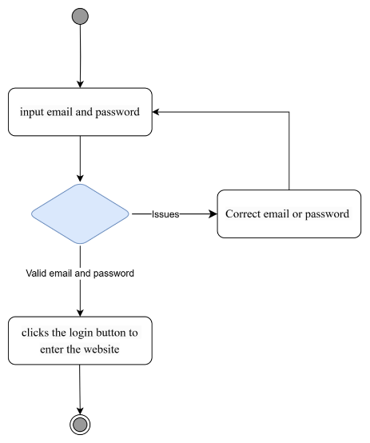

**Sequence Diagram** 

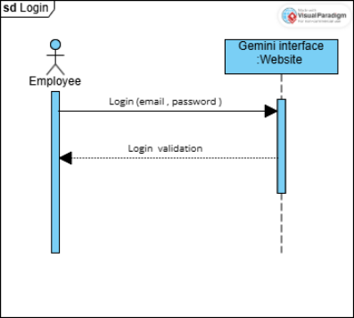

**Create science plans** 

**Use case description** 

|**Use Case Name:** Create science plans |**ID:** U002  |**Importance Level:**  High |
| - | - | - |
|**Primary Actor:** Astronomer |**Use Case Type:** Overview, Essential ||
|
**Stakeholders and Interests:** 

**Astronomer** – Needs to create detailed observation plans for successful data collection. **Science Observer** – Uses these plans to execute observations. 

**Telescope Operator** – Uses the plans to configure telescope settings. 
|||
|**Brief Description:** The astronomer creates an observation plan by defining scientific objectives, observational  methods,  and  telescope  configurations.  This  plan  is  then  used  to  execute observations. |||
|**Trigger:** The astronomer initiates the creation of a new science plan. **Type:**  External |||
|
**Relationships:** 

`    `Association: Science Observer, Telescope Operator 

`    `Include: Test Science Plans (UC2), Submit Science Plans (UC3)     Extend: Transform Science Plans (UC4) 

`    `Generalization:- 
|||

|
**Normal Flow of Events:** 

1. The astronomer logs into the Gemini Telescope System. 

2. The astronomer selects the option to Create a New Science Plan. 

3. The system prompts the astronomer to enter: 

a. Observation objectives (e.g., study exoplanets, analyze star formations). 

b. Observational methods (e.g., long-exposure imaging, spectroscopy). 

c. Telescope configurations (e.g., instrument selection, exposure time, filters). 

4. The system validates the plan for completeness and feasibility. 

5. The astronomer reviews and finalizes the plan. 

6. The system saves the science plan and marks it as ready for testing. 
|
| - |
|**Subflows:** If the astronomer misses any required fields, the system highlights missing information and requests input before proceeding. |
|
**Alternate/Exceptional Flow:**  

- **Incomplete Information:** If the astronomer attempts to submit an incomplete form, the system displays an error message and prevents submission. 

- **Technical Issues:** If the system encounters an error while validating the plan, an error message is displayed, and the astronomer is advised to retry later. 
|

**Activity diagram** 

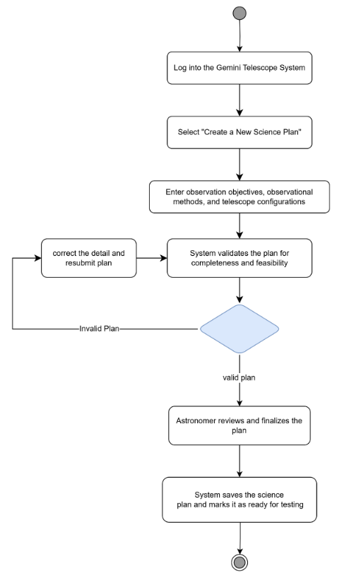

**Sequence Diagram** 

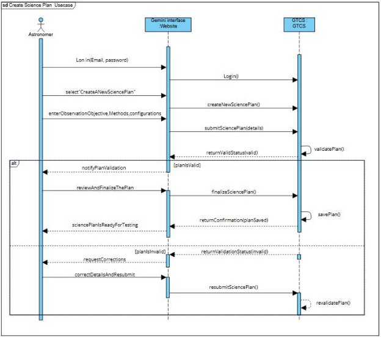

**Test Science Plans** 

**Use case description** 

|**Use Case Name:** Test Science Plans |**ID:** U003 |**Importance Level:**  High |
| - | - | - |
|**Primary Actor:** Astronomer |**Use Case Type:** Detail, Essential ||
|
**Stakeholders and Interests:**  

**Astronomers:** Check that the science plans will give useful data and ensure the necessary tools and resources are set up properly. 
|||
|**Brief Description:** This use case describes the process of testing a Science Plan using a Virtual Telescope  and  Interactive  Observing  Mode.  The  system  allows  astronomers  to  simulate observations in real time, interact with parameters, and validate the feasibility of the plan before execution. |||
|
**Trigger:** The testing of a science plan is triggered when a new plan is created or when an existing plan requires validation before execution. 

**Type:** External 
|||
|
**Relationships:** 

`    `Association: Astronomer 

`    `Include: Login, Operate the interactive observing (virtual telescope)     Extend: - 

`    `Generalization: - 
|||
|
**Normal Flow of Events:** 

1. The astronomer logs in to the Gemini website. 

2. The astronomer selects the science plan session. 

3. The astronomer chooses a science plan from the available list. 
|||

|
4. The astronomer clicks the test button on the selected science plan's interface. 

5. If the test passes → Review the result. 

6. If the test fails → Proceed to log errors. 

7. Error classification: 

- Warning → Log as a Warning Log. 

- Serious → Log as a Serious Log. 

- Fatal → Log as a Fatal Log. 

8. The astronomer reviews the result. 

9. The astronomer sends the result (which may contain errors) to the science observer. 
|
| - |
|**Subflows:**  Logging in and selecting a science plan is a preparatory process before testing. |
|
**Alternate/Exceptional Flow:** 

- If the test fails, it is categorized into different error logs based on severity. 

- If no errors occur, sending results to the science observer may not be necessary. 
|

**Activity diagram** 

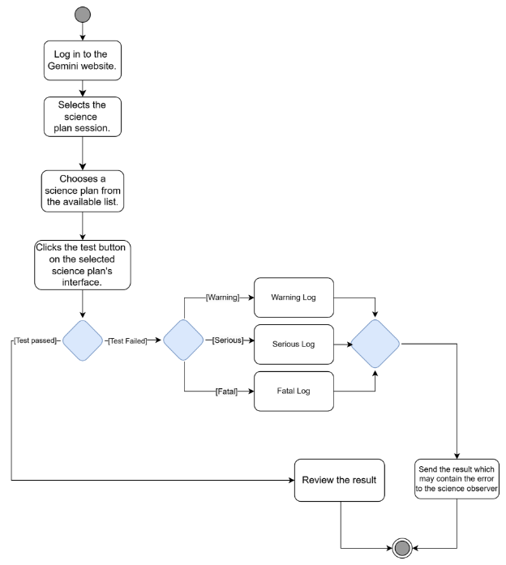

**Sequence Diagram** 

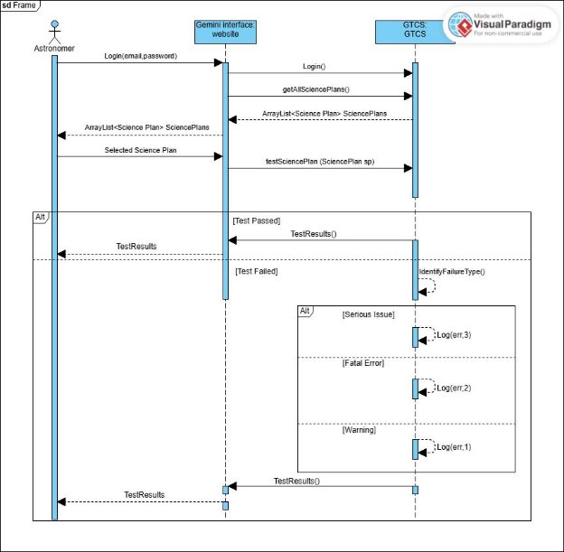

**Submit a Science Plan** 

**Use case description** 

|**Use Case Name:** Submit a Science Plan |**ID:** U004 |**Importance Level:**  High |
| - | - | - |
|**Primary Actor:** Astronomer |**Use Case Type:** Essential ||
|
**Stakeholders and Interests:**  

- Astronomer: Wants to submit a science plan for telescope observation. 

- System: Ensures validation, scheduling, and execution of the submitted science plan. 
|||
|**Brief Description:** The Astronomer submits a science plan containing observation details such as target selection, instrument configuration, and exposure settings. The plan undergoes validation by the Science Observer before being converted into an observing program for execution. |||
|**Trigger:** The Astronomer decides to submit a science plan for approval. **Type:** External |||
|
**Relationships:** 

`    `Association: Astronomer, Science Observer     Include: -    

`    `Extend: - 

`    `Generalization:- 
|||
|
**Normal Flow of Events:** 

1\.  The astronomer logs into the Gemini website. 

- The astronomer enters their email and password. 

- The system verifies the credentials and grants access. 
|||
2. The astronomer selects a science plan session. 
   1. The astronomer chooses an available session to submit the science plan. 
   1. The system creates a science plan session. 
2. The system verifies the astronomer’s authorization. 
   1. The system checks the astronomer’s authorization. 
2. The astronomer submits the science plan. 
   1. The astronomer finalizes and submits the science plan through the system. 
2. The system logs and stores the submitted science plan. 
   1. The system records and stores the submitted science plan. 
2. The astronomer modifies and resubmits if required. 
   1. If necessary, the astronomer updates the plan and resubmits it. 
2. The system validates the observing program. 
   1. The system verifies the validity of the observing program. 
2. The system confirms approval and scheduled execution. 
- The system confirms approval. 
- The system schedules the execution of the observing program. 

**Subflows:**  

**1: Auto-Save Draft** 

- If the astronomer does not submit the science plan within a certain timeframe, the system automatically saves the current progress as a draft. 
- The astronomer can later resume editing and finalize submission without losing their work. 

**2: Authorization Check** 

- If the astronomer is not authorized, the system rejects the submission and notifies the astronomer. 

`            `**3: Notification to Science Observer** 

- Once the science plan is successfully submitted, the system automatically notifies the assigned Science Observer. 
- The Science Observer receives details of the submitted plan for further review and processing. 

**Alternate/Exceptional Flow: **

**1: Incomplete Submission** 

- If the astronomer submits a science plan with missing required fields, the system prompts  the  astronomer  to  complete  all  necessary  fields  before  allowing submission. 

**2: Authorization Failure** 

- If an unauthorized user attempts to submit a science plan: 
  - The system denies access and displays an error message. 

**Activity diagram** 

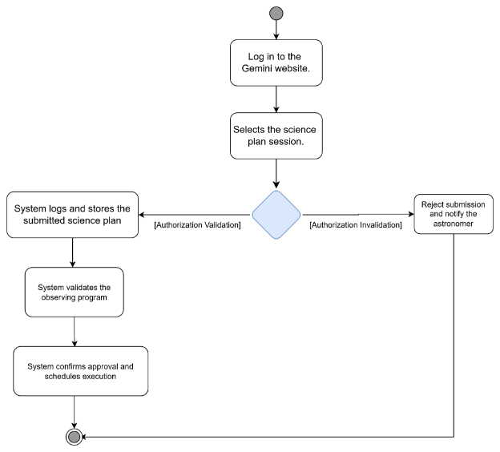

**Sequence Diagram** 

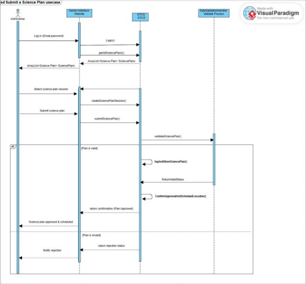

**Manage astronomical data** 

**Use case description** 

|**UseCase Name:** Manage astronomical data |**ID:** U005 |**Importance Level:**  High |
| - | - | - |
|
**Primary Actor:  Science Observer** (Primary Actor) 

`                 `**Astronomer** (May have access to certain data) 
|**Use Case Type:** Business Use Case ||
|
**Stakeholders and Interests:**  

- **Science Observer:** Needs to manage, validate, and organize astronomical data for research and analysis. 

- **Astronomer:** May require access to properly managed datasets for scientific studies. 

- **System  Administrator:**  Ensures  that  user  access  and  system  integrity  are maintained, and assists in error resolution. 
|||
|**Brief Description:** This use case allows the Science Observer to manage collected astronomical data, including validation, tagging, categorization, and metadata updates. The system ensures data integrity and logs all modifications for security and traceability. |||
|
**Trigger:**  

**Event-Driven:** When new data is collected and needs to be processed. 

**User-Driven:** When the Science Observer manually selects datasets for management. **Type:** External 
|||
|
**Relationships:** 

Association: Science Observer, Astronomer,System Admin Include: - 

Extend: - 
|||

|
**Normal Flow of Events:** 

1. The Science Observer logs into the system. 

2. The system presents a list of available astronomical datasets. 

3. The observer selects a dataset for management. 

4. The observer performs one or more of the following actions: 

a. Tagging data with metadata. 

b. Validating data integrity. 

c. Categorizing data into relevant projects. 

5. The system validates data integrity. 

a. If valid, the system saves changes and updates logs. 

b. If invalid, the observer receives error details and can retry. 

6. The observer can view, retrieve, or further modify the managed data. 

7. The system confirms successful management operations. 
|
| - |
|
**Subflows:** 

**Data  Tagging:**  The  observer  assigns  relevant  metadata  (e.g.  celestial  objects,  observation  date, telescope used,). 

**Data Validation:** The system runs an integrity check and reports any errors or missing data. **Categorization:** The observer organizes the data into projects or observational programs. 
|
|
**Alternate/Exceptional Flow:** 

**Astronomer Requests Access to Managed Data:** 

1. The Astronomer requests access to a dataset. 

2. The system checks permissions and either grants or denies access. 

3. If denied, the Astronomer has two options: 

- Request elevated permissions from the System Administrator. 

- Accept the restriction and move on. 

4. If  the  Astronomer  requests  elevated  access,  the  System  Administrator  reviews  the request: 

- If approved, the Astronomer gains access. 

- If  rejected,  the  decision  is  final,  and  they  cannot reattempt access without a change in permissions. 

**Data Validation Fails (With Retry Limit):** 

1\.  The system detects an error in the data and notifies the observer. 
|

2. The observer can retry fixing the issue and revalidate the data. 
2. Retry Limit Rule: 
   1. The observer can attempt to fix and revalidate up to 3 times. 
   1. If all 3 attempts fail, the system automatically flags the data for review. 
   1. The System Administrator is notified for further action. 
2. If the observer flags the data manually, the admin is notified immediately. 

**Activity diagram** 

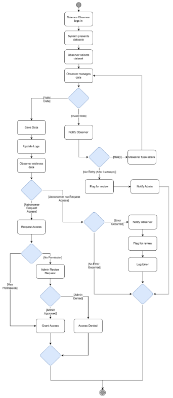

**Sequence Diagram** 

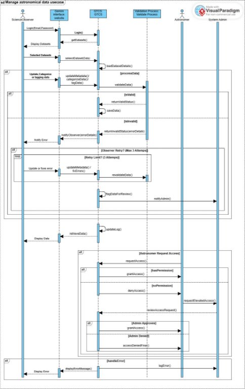

**Validate  a Science Plan** 

**Use case description** 

|**UseCase Name:** Validate a Science Plan |**ID:** U006 |**Importance Level:**  High |
| - | - | - |
|**Primary Actor:** Science Observer |**UseCase Type:** Essential ||
|**Stakeholders  and  Interests:**  Telescope  Operator  –  May  need  to  check  if  the  program  is compatible with telescope operations and constraints. |||
|**Brief Description: The** Science Observer validates the plan to ensure it aligns with telescope and instrument capabilities. |||
|
**Trigger:** When an Astronomer submits a science plan to the system for review. This occurs after the astronomer has created and tested the plan using the virtual telescope and interactive observing mode. 

**Type:** External 
|||
|
**Relationships:**  

`    `Association: Telescope Operator, Astronomer     Include:  - 

`    `Extend: - 

`    `Generalization:- 
|||
|
**Normal Flow of Events:** 

1. The Science Observer logs in to the Gemini system. 

2. The Science Observer navigates to the Science Plan Validation section. 

3. The Science Observer selects a submitted science plan from the available list. 

4. The Science Observer reviews the details of the science plan, including target selection, exposure time, and instrument configuration. 
|||
5. The Science Observer clicks the validate button to check the plan’s feasibility. 
5. The system runs validation checks on telescope compatibility, scheduling constraints, and observation feasibility. 
5. The Science Observer reviews the validation results displayed by the system. 
5. If the plan is valid, the Science Observer approves it for transformation into an observing program. 
5. If issues are found, the Science Observer requests modifications, and the plan is sent back to the Astronomer for revision. 

**Subflows:** 

1. **Telescope Capability Check Subflow** 
1. The system checks if the selected telescope and instruments match the science plan requirements. 
1. If any instrument is unavailable or incompatible, the system flags the issue. 
1. The Science Observer reviews flagged issues and determines whether adjustments can be made or if the plan must be revised. 
2. **Scheduling Constraint Check Subflow** 
1. The  system  verifies  if  the  requested  observation  time  fits  within  the  telescope's available schedule. 
1. If  conflicts  exist  (e.g.,  overlapping  schedules,  maintenance  periods),  the  system suggests alternative slots. 
1. The Science Observer reviews conflicts and may adjust the plan or request revisions. 
3. **Observation Feasibility Check Subflow** 
1. The  system  evaluates  factors  like  weather  conditions,  visibility,  and  technical constraints. 
1. If conditions are unfavorable, the system suggests alternative observation times or locations. 
1. The Science Observer decides whether to approve the plan with modifications or return it for revision. 

**Alternate/Exceptional Flow:** 

1. **If the Science Plan Fails Validation** 
1. The  system  highlights  errors  or  conflicts  (e.g.,  scheduling  issues,  incompatible instruments). 
1. The Science Observer reviews the specific validation failures. 
3. The  Science  Observer  adds  comments  and  requests  modifications  from  the Astronomer. 
3. The system notifies the Astronomer to revise and resubmit the science plan. 
2. **If the Science Plan Passes Validation** 
1. The system marks the plan as validated. 
1. The Science Observer confirms the validation and approves the science plan. 
1. The system transforms the approved science plan into an observing program. 
1. The system notifies relevant users that the plan is ready for execution. 

**Activity diagram**  

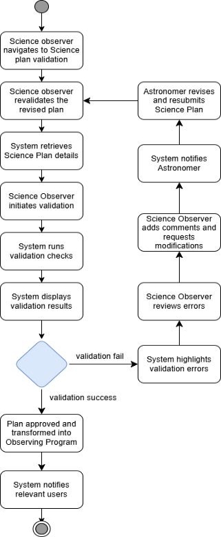

**Sequence Diagram** 

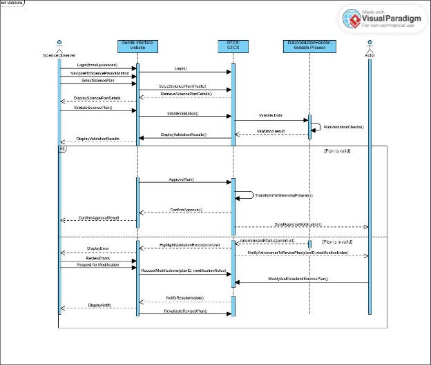

**Class diagram** 

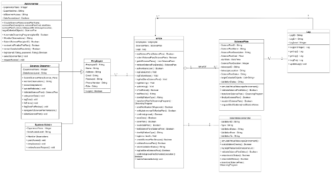
